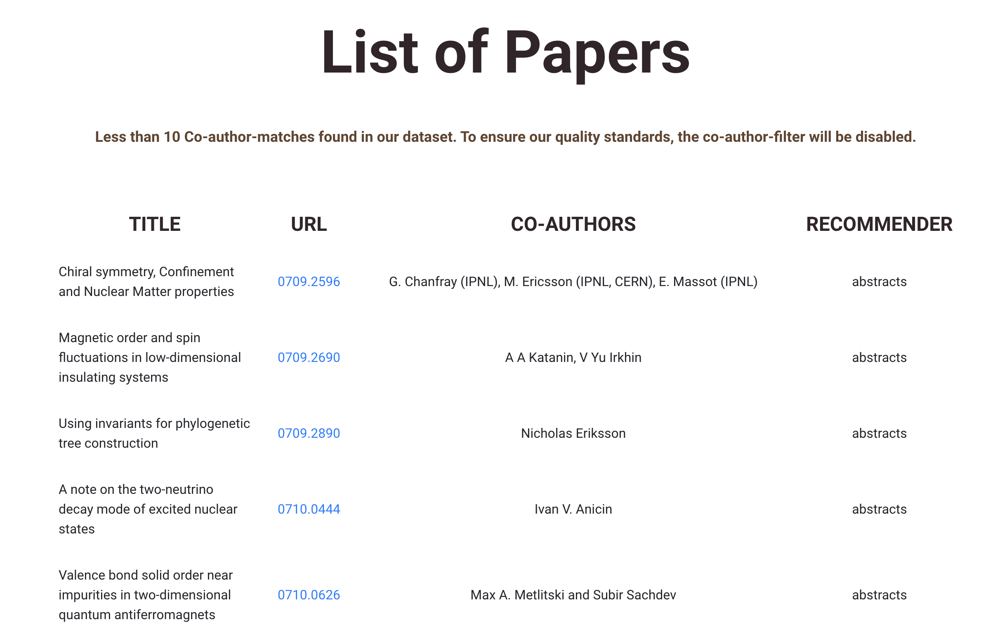

# Machine Learning Project
Das vorliegende Projekt beschäftigt sich mit der Thematik der Recommender Systeme in Bezug auf die Empfehlung wissenschaftlicher Paper von [Arxiv](https://arxiv.org) und wurde im Rahmen der Vorlesung Machine Learning Project an der DHBW Mannheim erstellt. Der Zeitraum der Ausarbeitung erstreckte sich vom 20.05.2021 bis zum 27.07.2021.

Das Recommender System setzt sich aus verschiedenen Komponenten zusammen. So werden textuelle Features, Metadaten wie Autoren und in den Paper verwendete Bilder zur Empfehlung herangezogen.

* [Hardwarevoraussetzungen](#hardwarevoraussetzungen)
* [Vorbereitung](#vorbereitung)
    * [Vortrainierte Bereitstellung des Projektes](#vortrainierte-bereitstellung-des-projektes)
    * [Retraining mit neuen oder anderen Daten](#retraining-mit-neuen-oder-anderen-daten)
* [Ausführen des Codes](#ausführen-des-codes)
    * [API](#api)
    * [Frontend](#frontend)


# Hardwarevoraussetzungen
Das folgende Projekt stellt hohe Anforderungen an die Hardware, auf der es ausgeführt wird.  
Abhängig davon, ob ein Neutraining angestrebt wird, sind so also mindestens 30 GB Speicherplatz notwendig.  
Des weiteren werden **mindestens 32 GB RAM** für die Vorhersagegenerierung empfohlen. Auf Systemen mit geringeren Spezifikationen ist das Projekt nicht getestet worden und kann ggf. zu Fehlfunktionen führen.  

Um das Neutrainining anzuregen, ist außerdem eine performante GPU + CUDA empfehlenswert, da so der Trainingsprozess deutlich verkürzt wird.  

# Vorbereitung
Um den vorhandenen Code auszuführen zu können, sind folgende Anweisungen auszuführen:  

```
pip install -r requirements.txt  
```

Nun kann zwischen der Nutzung der bereits trainierten Modelle und einem neu gestarteten Training gewählt werden.

## Vortrainierte Bereitstellung des Projektes

Um bereits vorverarbeiteten Daten beziehen zu können, muss der folgende Python-Code auf der obersten Ebene des Repositories ausgeführt werden.  

```
import gdown   
import zipfile  

# Beziehen der pickle-files (Modelle, Vectoren, Metadaten)  
gdown.download('https://drive.google.com/uc?id=1FuTYss2WElJuA1zkU-ldXg9n-_g3bzby')  

# Extrahieren des Archivs
with zipfile.ZipFile("resource.zip", 'r') as zip_ref:  
    zip_ref.extractall("./resource")  
```

## Retraining mit neuen oder anderen Daten

Hierfür sind die folgenden Anweisungen in der Kommandozeile beginnend auf der obersten Ebene des Repositories auszuführen.
Falls Cuda aktuell nicht installiert ist, sollte es installiert werden!
Ansonsten wird der Schritt "python ./create-knn-datasets.py" einige Zeit in Anspruch nehmen.

```
cd ./src/arxiv-data-access # navigate to the arxiv-data-access folder

python ./download-files.py # please modify the file if you want to download any other topics
```  
```  
######################## MANUAL STEP ##########################  
# The arXiv-metadata must be downloaded manually from kaggle.com by following these steps:

https://www.kaggle.com/Cornell-University/arxiv?select=arxiv-metadata-oai-snapshot.json

# Unpack the archive, s.t. the file /resource/arxiv-metadata-oai-snapshop.json will be created  
############################################################### 
```  
```
cd ./src/arxiv-data-access # navigate again into the arxiv-data-access folder

python ./metadata-collector.py # creates the co-author-mapping and DataFrames for the metadata

cd ../KNNRecommends # navigate to the KNN-folder

python ./create-knn_sciBERT-datasets.py # Vectorize the titles and abstracts of the downloaded papers  

cd ../vae-model-training
python create-image-vectors.py
```

# Ausführen des Codes

## API
Mittels einer API können nahezu alle arXiv-Paper mit Ausnahme der aktuellesten Paper, da diese noch nicht in den Metadaten enthalten sind, verarbeitet werden.

Um die API zu starten, müssen ausgehend der obersten Ebene des Repositories folgendes Schritte beachtet werden:

```
cd ./src/  
python ./api.py  
```

Nachdem die Schritte durchgeführt wurden, ist die API aktiv.  

Anfragen an die API müssen folgendem Format folgen:

    0.0.0.0:12345/api?url=**Link zum PDF**&pipeline=**Schritte der Empfehlungspipeline**

Ein Beispiel dafür ist der folgende Code:

    0.0.0.0:12345/api?url=https://arxiv.org/pdf/gr-qc/9411004&pipeline=titles,abstracts


## Frontend
Alternartiv zur manuellen Abfrage der API kann die extra für diesen Zweck entwicklete Webanwendung verwendet werden. Die API muss hierfür allerdings ebenfalls aktiv sein. Die Anwendung kann wie folgt gestartet werden.

``` 
python frontend/app.py  
```

In dieser Anwendung können die einzelenen Module der Empfehlung ausgewählt werden. So kann individuell bestimmt werden, ob Empfehlungen über kollaborierende Autoren, Titel der Paper, vorhandene Bilder oder die Abstracts der Paper getroffen werden sollen. Für eine verbesserte Vorhersage kann die Bedingung der kollaborierenden Autoren als Filter für die anderen Modelle verwendet werden. In diesem Fall muss aber zwingend auch das Feld Co-Authors ausgewählt werden.

Das zweite Inputfeld verlangt einen Link zu einem Arxiv Paper im PDF Format. Zum Beispiel https://arxiv.org/pdf/1306.0269.pdf


Anschließend wird eine Liste angezeigt, die alle empfohlenen Paper enthält. In der Liste wird der Titel des empfohlenen Paper, die URL des  Papers auf Arxiv, die Autoren des Papers sowie das Modell, auf dem die Empfehlung basiert, bereitgestellt. Etwaige Anmerkungen zu den verwendeten Modellen oder Fehlermeldungen werden oberhalb der Liste angezeigt.

 
